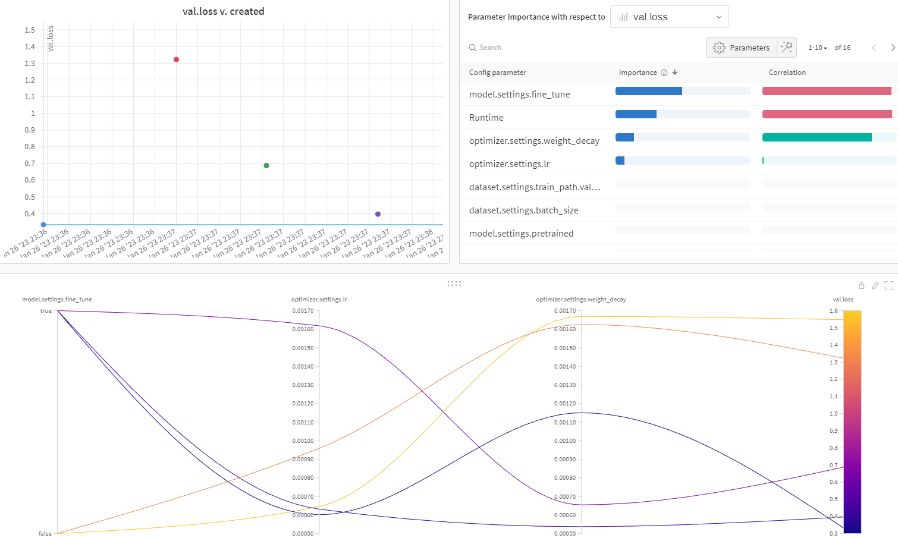

# Pytorch-train-pipeline

Pytorch pipeline able to train deep learning models in an efficient 
and modular way.

This pipeline integrates WandB, an experiment tracking tool for 
machine learning, and Hydra, a framework that simplifies the development
of research and other complex applications.

In addition to that, the code is meant to be fully extensible, you should be able to 
implement your own custom models/losses/optimizers without changing 
existing code.


### WandB
WandB is an experiment tracking tool for machine learning.

Using WandB in the pipeline you will be able to:
- Track the hyperparameters and metrics of every run
- Display the predictions through the different epochs
- Upload complex media and charts
- Save your model as a WandB artifcat
- Hyperparameter search using Sweeps

For more information on how it works, visit its [documentation](https://docs.wandb.ai/).


### Hydra
Hydra is a framework that simplifies the development of research and other complex applications.

Using Hydra in the pipeline you will be able to have a modular configuration schema in order 
to build your experiment configurations easier.

The Hydra configuration schema is the following:
```
conf
├── config.yaml             # config.yaml calls one .yaml file for 
├── dataset                 # every module inside the schema
│   ├── MNIST.yaml          # the .yaml files inside every module
│   └── cifar10.yaml        # specify the configuration of that module   
├── model                   
│   ├── resnet.yaml         
│   └── ...   
└── ...
```
For more information on how it works, visit its [documentation](https://hydra.cc/docs/intro/).

Hydra configuration is used when running a single training experiment. 
Such configuration is not used when doing hyperparameter search with WandB sweeps,
as it will use the sweep as its configuration.

# Train
CLI command to run a training experiment.
```
python main.py --config_name=<config_name> --wandb_name=<wandb_project_name>
```
- ``--config_name``: Name of .yaml file that specifies the config files 
that will be used to build the configuration (e.g. config)
- ``--wandb_name``: Name of the WandB project already created in order to track
the experiment

If no ``wandb_name`` is specified, then it will execute an offline training, which will
not be logged into WandB, in case you are not interested in tracking that run.

# Hyperparameter search (WandB sweep)
CLI command to run a hyperparameter search experiment.
```
python main_sweep.py --sweep=<sweep_file> --sweep_count=<n_runs> --wandb_name=<wandb_project_name>
```
- ``--sweep``: Name of the sweep file inside the ``sweeps`` folder to be used (e.g. sweep.yaml)
- ``--sweep_count``: Number of runs to execute
- ``--wandb_name``: Name of the WandB project already created in order to track
the experiment

All the arguments are necessary.

After executing your sweep you will be able to see your sweep board in your WandB project and track
all the runs.

